  
   
   
  

    
    
    
    
  

  

    
    
    
    
  

  

    <code>OPEN SOURCE INFRASTRUCTURE</code> • <code>B2B ENTERPRISE PLATFORMS</code> • <code>MULTI-TENANT SAAS</code> • <code>SOVEREIGN RAG</code> • <code>NETWORK DAEMONS</code>
  

  

    
    
    
    
    
    
    
    
     
    
    
    
    
    
    
     
    
    
    
    
    
    
    
  

Welcome to the **LOUST PRO** engineering organization. We are the technology provider behind a wide range of B2B platforms, enterprise systems, and high-performance open-source infrastructure. Our focus is on multi-protocol transport, hardened Linux substrates, and systems that survive multi-year horizons.

 

We are building a powerful community of engineers, AI researchers, and sysadmins. The **LZT-Developers** repository is an AGPLv3-licensed Next.js web application built for the community. Rather than editing a massive monolithic file, joining is entirely declarative and programmatic.

**Do you want to feature your profile alongside other top engineers?**  
Just click the button below to automatically open a Pull Request with your YAML profile.

  

<table>
  <tr>
    <td valign="top" width="50%">
      <strong>Systems & Network Infrastructure</strong> 
      Systems programming and daemon tooling that solves deep kernel, network, and hardware edge cases.  
      <ul>
        <li><a href="https://github.com/LOUST-PRO/storage-mountguardian"><b>storage-mountguardian</b></a> 
          Rust daemon for proactive SCSI/USB failure amputation. Protects I/O bounds against D-state locks. 
            
        </li>
         
        <li><a href="https://github.com/LOUST-PRO/SnapPipe"><b>SnapPipe</b></a> 
          Identity-anchored transport toolkit that solves the SSH/QUIC head-of-line blocking problem. Binds sessions to Ed25519 public keys. 
            
        </li>
         
        <li><a href="https://github.com/LOUST-PRO/NetBoozt_InternetUpgrade"><b>NetBoozt</b></a> 
          Cross-platform TCP optimization and intelligent DNS failover. Delivers Linux BBR-equivalent gains. 
            
        </li>
         
        <li><a href="https://github.com/LOUST-PRO/ical-to-caldav"><b>ical-to-caldav</b></a> 
          ICS subscription bridge daemon translating public endpoints into localized CalDAV streams. 
           
        </li>
      </ul>
    </td>
    <td valign="top" width="50%">
      <strong>AI, Data & Sovereign RAG</strong> 
      Advanced tooling for autonomous agents, LLM pipelines, and verifiable retrieval-augmented generation.  
      <ul>
        <li><a href="https://github.com/LOUST-PRO/deterministic-sovereign-rag"><b>deterministic-sovereign-rag</b></a> 
          ArXiv preprint and reproducible pipeline for Sovereign AI. Implements signed-hash projection. 
            
        </li>
         
        <li><a href="https://github.com/LOUST-PRO/dsvh-verification-suite"><b>dsvh-verification-suite</b></a> 
          Empirical validation testbed for FNV-1a + L2 pipelines, designed for concurrency stress testing. 
           
        </li>
         
        <li><a href="https://github.com/LOUST-PRO/LLMmempipe"><b>LLMmempipe</b></a> 
          Compiler translating noisy LLM export payloads (ChatGPT, Claude, Gemini) into canonical JSONL records to eliminate token bloat. 
            
        </li>
         
        <li><a href="https://github.com/LOUST-PRO/TaxonRouter"><b>TaxonRouter</b></a> 
          Dual-binary GitHub automation: MCP server + webhook auto-tagger for metadata orchestration. 
            
        </li>
      </ul>
    </td>
  </tr>
</table>

 

Beyond open source, LOUST PRO architectures power large-scale private ecosystems.

<table>
  <tr>
    <td valign="top" width="50%">
      <strong>Enterprise CMS & Commerce</strong> 
      Multi-tenant content + commerce + operations platform with isolated Postgres/Redis namespaces per tenant. 
        
    </td>
    <td valign="top" width="50%">
      <strong>SocialSphere</strong> 
      PropTech + hospitality ERP. Multi-property booking, turnover calendars, and channel-manager hooks. 
        
    </td>
  </tr>
  <tr>
    <td valign="top" width="50%">
      <strong>CRM Hub & Sales Pipelines</strong> 
      Pipeline + contact + closing surfaces for sales teams. Sub-2-minute lead-to-quote latency. 
       
    </td>
    <td valign="top" width="50%">
      <strong>Nexus Apps Automation</strong> 
      Rule + webhook engine for client operations. Connects Meta Ads, Google Ads, Stripe, MercadoPago, and CFDI 4.0. 
       
    </td>
  </tr>
</table>

 

To understand how we operate at LOUST PRO, including our **AI-Native Engineering Pipeline**, **Model Context Protocol (MCP)** interactions, and our strict **Deterministic Sovereign RAG** specifications, please read our central collaboration handbook.

👉 **[Read the LOUST-PRO / Start-Here Guidelines](https://github.com/LOUST-PRO/start-here)**

---

  <i>"Leveraging Opportunities Unleashing Success and Transformation"</i>

